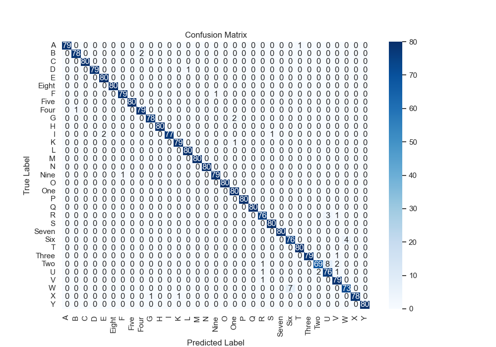
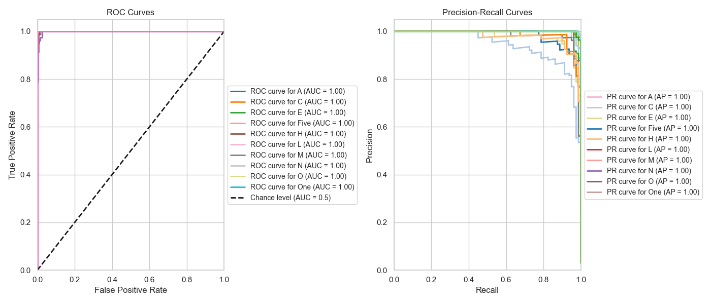

# Sign Language Interpreter


Communication is important for everyone, but people in the Deaf and Mute (D&M) community often struggle because many others don't know sign language. This project aims to help by creating a real-time Sign Language Interpreter that turns American Sign Language (ASL) gestures into text and speech, making it easier for them to connect with others.

## Table of Contents

1. [Abstract](#abstract)
2. [Project Description](#project-description)
   - [Key Components](#key-components)
   - [Audio Feedback Feature](#audio-feedback-feature)
   - [Project Goals](#project-goals)
   - [Supported Gestures](#supported-gestures)
3. [Project Structure](#project-structure)
4. [Installation](#installation)
   - [Prerequisites](#prerequisites)
   - [Steps for Installation](#steps-for-installation)
   - [Installation Notes](#installation-notes)
5. [Dataset Collection](#dataset-collection)
   - [Step 1: Prepare Labels](#step-1-prepare-labels)
   - [Step 2: Capture Gesture Images](#step-2-capture-gesture-images)
6. [Dataset Creation](#dataset-creation)
   - [Step 1: Process the Captured Data](#step-1-process-the-captured-data)
   - [Step 2: Verify the Dataset](#step-2-verify-the-dataset)
7. [Model Training](#model-training)
   - [Step 1: Train the Model](#step-1-train-the-model)
   - [Step 2: Evaluate the Model](#step-2-evaluate-the-model)
8. [Real-Time Inference](#real-time-inference)
   - [Step 1: Run the Inference Script](#step-1-run-the-inference-script)
   - [Step 2: Interact with the System](#step-2-interact-with-the-system)
   - [Audio Feedback Feature](#audio-feedback-feature)
9. [Results](#results)
    - [Key Metrics](#key-metrics)
10. [Future Work](#future-work)
11. [Contributing](#contributing)
12. [License](#license)
13. [Contact](#contact)
14. [Credits](#credits)

## Abstract

Sign language is a crucial communication tool for the Deaf and Mute (D&M) community. However, since most people do not understand sign language and interpreters are not always available, there is a need for a reliable method to translate sign language into text and speech. This project presents a real-time system that uses computer vision and machine learning techniques to interpret American Sign Language (ASL) alphabets and numbers. By leveraging MediaPipe for hand landmark detection and a Random Forest classifier for gesture recognition, the system achieves high accuracy and provides real-time feedback, including audio output corresponding to the recognized gesture.

## Project Description

American Sign Language (ASL) is widely used within the Deaf and Mute community as a means of communication. Given the challenges faced by these individuals in communicating with those who do not understand sign language, this project aims to bridge the communication gap by translating ASL gestures into text and speech in real-time.

### Key Components:
- **Sign Language Detection:** Uses a webcam to capture hand gestures and identifies ASL letters and numbers.
- **Hand Landmark Detection:** Utilizes MediaPipe to detect hand landmarks.
- **Classification:** A Random Forest classifier trained on self-collected data.
- **Real-Time Inference:** Predicts the gesture and provides text and audio feedback.

### Audio Feedback Feature
An additional feature of this project is the ability to play an audio file corresponding to the recognized gesture. For example, when the model predicts the letter "A," the system will play an audio file that says "A." This feature enhances the accessibility of the system by providing an audible output, making it useful in educational environments and communication tools.

The audio files are stored in the `audios/` directory, with each file named after the corresponding letter or number (e.g., `A.wav`, `One.wav`).

### Project Goals:
- To create an accessible tool for real-time sign language recognition.
- To allow anyone, including those unfamiliar with ASL, to understand and communicate with D&M individuals.
- To provide a flexible, modular system that can be expanded with additional gestures and languages.

### Supported Gestures
The system is trained to recognize the following ASL gestures:

**Alphabets:**
- A, B, C, D, E, F, G, H, I, K, L, M, N, O, P, Q, R, S, T, U, V, W, X, Y

**Numbers:**
- One, Two, Three, Four, Five, Six, Seven, Eight, Nine


## Features
- **Real-time Gesture Recognition**: Detects and interprets ASL gestures using a webcam.
- **Easy Dataset Collection**: Includes scripts for capturing and labeling gesture images.
- **Customizable Model**: Users can extend the model to recognize additional gestures.
- **Performance Visualization**: Displays metrics like confusion matrices, ROC, and Precision-Recall curves.

## Project Structure
```plaintext
sign_language_interpreter/
├── audios/                    # Directory containing audio files for each gesture
├── dataset/                   # Directory for captured gesture data
├── artifacts/                 # Directory for saved models and data artifacts
├── src/                       # Source code for the project
│   ├── config.py              # Configuration file with paths and constants
│   ├── data_collection.py     # Script for capturing gesture images
│   ├── data_creation.py       # Script for creating a dataset from images
│   ├── model_training.py      # Script for training the model
│   ├── app.py                 # Script for running real-time inference
│   ├── utils.py               # Utility functions
├── labels.txt                 # File containing gesture labels
├── requirements.txt           # Python dependencies
├── .gitignore                 # Files and directories to ignore in git
└── README.md                  # Project documentation
```

## Installation

The installation process involves setting up a Python environment and installing the required dependencies. The instructions below provide steps for macOS, Windows and Linux systems.

### Prerequisites

Ensure you have the following installed:
- Python 3.7+
- pip (Python package installer)
- git

### Steps for Installation

1. **Clone the repository:**
   ```sh
   git clone https://github.com/ACM40960/project-bhupendrachaudhary08.git
   cd project-bhupendrachaudhary08
   ```

2. **Create a virtual environment:**
   ```sh
   python -m venv venv
   ```

   - **On macOS/Linux:**
     ```sh
     source venv/bin/activate
     ```
   - **On Windows:**
     ```sh
     venv\Scripts\activate
     ```

3. **Install the dependencies:**
   ```sh
   pip install -r requirements.txt
   ```

### Installation Notes

- **macOS/Linux:** Ensure that you have the necessary permissions and use the `source` command to activate the virtual environment. For some Linux distributions, you may need to install additional libraries (e.g., `sudo apt-get install python3-venv`).
  
- **Windows:** Make sure to use the correct path to activate the virtual environment. You may need to enable script execution by running `Set-ExecutionPolicy RemoteSigned -Scope Process` in PowerShell.

## Dataset Collection

### Step 1: Prepare Labels
The `labels.txt` file contains the ASL letters and numbers that the model will recognise. If you need to add or remove gestures, you can edit this file. You can also comment out any line by placing a # in front of it, and that line will be ignored during data collection and processing.

**Current Labels:**
```plaintext
# Alphabets
A
B
C
D
E
F
G
H
I
K
L
M
N
O
P
Q
R
S
T
U
V
W
X
Y

# Numbers
One
Two
Three
Four
Five
Six
Seven
Eight
Nine
```

### Step 2: Capture Gesture Images
This project involves building a custom dataset using images captured from a webcam. Run the following script to capture gesture images:
```bash
python src/data_collection.py
```
- The script will guide you through capturing images for each label.
- **Press `SPACE`** to start capturing images for a label.
- **Press `ESC`** to skip to the next label.
- **Press `q`** to quit the script.

The captured images will be stored in the `dataset/` directory, with subfolders for each label.

[//]: # (#### Example Screenshot:)

[//]: # (![Data Collection]&#40;./docs/images/data-collection.png&#41;)

## Dataset Creation

### Step 1: Process the Captured Data

After collecting the images, run the dataset creation script to extract hand landmarks:

```bash
python src/data_creation.py
```

This script processes the images using MediaPipe, extracts hand landmarks, and saves the processed data as a pickle file in the `artifacts/` directory.

[//]: # (#### Example Screenshot:)

[//]: # (![Dataset Creation]&#40;./docs/images/dataset-creation.png&#41;)

### Step 2: Verify the Dataset
Check the `artifacts/` directory for the `data.pickle` file, which contains the processed dataset.

## Model Training

### Step 1: Train the Model
To train the Random Forest model on the processed dataset, run the following script:

```bash
python src/model_training.py
```

The script performs the following steps:
- **Splits the Data:** Separates the dataset into training and testing subsets.
- **Model Training:** Trains a RandomForest classifier.
- **Model Evaluation:** Evaluates the model using metrics such as accuracy, confusion matrices, ROC curves, and Precision-Recall curves.
- **Model Saving:** Saves the trained model to the `artifacts/` directory.

### Step 2: Evaluate the Model
During training, the following plots are generated to assess the model's performance:

#### Confusion Matrix:


#### ROC and Precision-Recall Curves:


## Real-Time Inference

### Step 1: Run the Inference Script

Once the model is trained, run the following script to start real-time gesture recognition:

```bash
python src/app.py
```

### Step 2: Interact with the System

- The script uses your webcam to detect hand gestures in real-time.
- Predicted gestures are displayed on the screen along with the corresponding audio output.
### Audio Feedback Feature

The `app.py` script also plays an audio file corresponding to the recognized gesture. For example, if the model predicts the letter "A," it plays the audio file `A.wav` from the `audios/` directory. This feature provides an audible output that complements the text display, making the system more versatile, especially for educational purposes.

[//]: # (#### Example Video:)

[//]: # (Add a video here showcasing the real-time gesture recognition in action.)

## Results
The trained model successfully recognizes the following ASL gestures:
- **Alphabets:** A, B, C, D, E, F, G, H, I, K, L, M, N, O, P, Q, R, S, T, U, V, W, X, Y
- **Numbers:** One, Two, Three, Four, Five, Six, Seven, Eight, Nine

### Key Metrics:
- **Accuracy:** 100% on the test set.
- **AUC:** 1.00 for all gestures.
- **Precision-Recall:** 1.00 for all gestures.

## Future Work
Future improvements to this project include:
- **Expanding the Gesture Set:** Adding support for more complex gestures, two-handed gestures, and dynamic gestures involving motion.
- **Improving Generalization:** Collecting a larger, more diverse dataset to improve model robustness in different lighting conditions and environments.
- **Integrating with Other Applications:** Developing a mobile or web application to make the system more accessible in real-world scenarios.

## Contributing
Contributions are welcome! If you'd like to improve this project, please fork the repository and submit a pull request. Your contributions could include adding new features, improving documentation, or fixing bugs.

### Steps to Contribute:
1. Fork the repository.
2. Create a new branch.
3. Make your changes.
4. Submit a pull request.

## License
This project is licensed under the MIT License. See the [LICENSE](LICENSE) file for more details.

## Contact

For any questions or suggestions, please open an issue or contact me at [bhupendra.chaudhary@ucdconnect.ie](mailto:bhupendra.chaudhary@ucdconnect.ie).

## Credits

This project is in collaboration with [Sahil Chalkhure](https://github.com/ACM40960/project-sahilchalkhure26)